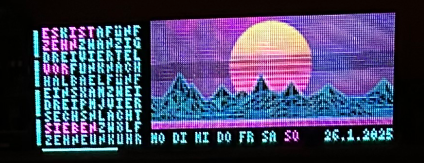

Programm uses an raspberry pi and 3 LED-Matrices (https://joy-it.net/de/products/LED-Matrix01) to display the time similar to qlocktwo, the current weather, roomtemperature and a picture.

Using the repo https://github.com/hzeller/rpi-rgb-led-matrix?tab=GPL-2.0-1-ov-file to interface to the panels.

Here a picture of how it looks at the moment: 
Line below the picture changes every 10 seconds.

# main.cs

## initializing objects
1. timer to call the api for the weather-data gets created
2. udp-connection to deskpi for roomtemperature
3. initalizing objects for date and panel

## endless loop for drawing on panels
while-loop which gets processed every 800ms
function GenerateMap generates the pattern for the qlocktwo part
panel.draw displays the information on the three panels
with the switchCounter a flag gets generated two switch between different information to be displayed  

## fast simulation of complete day cycle
code that can fast-forward through a whole day so the correct displaying of qlocktwo can be tested

# DataExchange.cs
In this class all the data is stored which is needed in different parts of the program.
There is only on instance of this class and on the first initializing the config.txt file is read in.
The field "pathConfigFile" has to be set to the correct file. 

# Panel.cs
Is the class responsible for drawing on the 3 panels. Only Draw-method has to be called. 

# TimeToMap.cs
This class creates the mapping from the actual time to the array of letters displayed on the panel.

# ActualWeather.cs/ForecastWeather.cs
Classes to store the deserialized data from the api-call.

# FileUtility
Static class for writing strings to text files.

# Picture.cs
Displays a picture form an array of RBG-values on the panels. The python-code in the directory "py" creates the needed array form a picture.

# UDP.cs
UDP-connection to a different pi to get the roomtemperature.

# WeatherAPI.cs
Handles the API-call to https://openweathermap.org/.