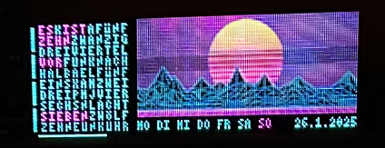

# ClockFromWords

A Raspberry Pi project that drives 3 chained 64×64 RGB LED matrices to display a German-language word clock (QlockTwo-style), outdoor weather, indoor temperature/humidity, and a custom picture.

Uses [hzeller/rpi-rgb-led-matrix](https://github.com/hzeller/rpi-rgb-led-matrix) to interface with the panels.

**Hardware:** 3× [joy-it LED-Matrix01](https://joy-it.net/de/products/LED-Matrix01) (64×64 px each, chained → 192×64 px total)



---

## Panel Layout

```
┌──────────────────────────────────────────────────────────────────────────────────────────────┐
│  Panel 1 (cols 0–63)        │  Panel 2 (cols 64–127)        │  Panel 3 (cols 128–191)       │
│                             │                               │                               │
│  QlockTwo word clock        │  Picture (128×54 px, spans panels 2+3)                        │
│  (10×11 German letter grid) │                                                               │
│  + minute bars (left edge)  │  ─────────────────────────────────────────────────────────    │
│  + seconds dot row (bottom) │  Info line (alternates every ~10 / ~20 s):                    │
│                             │  · Weekday + date  OR  · Indoor temp/humidity + weather       │
└─────────────────────────────┴───────────────────────────────────────────────────────────────┘
```

---

## Features

- **Word clock** – Displays time in 5-minute steps in German (ES IST FÜNF NACH, VIERTEL, HALB, DREIVIERTEL, …)
- **Minute bars** – 0–4 pixel bars on the left edge of panel 1 (and right edge of panel 3) show the remaining minutes within the 5-minute step
- **Seconds** – Row of pixels at the very bottom of panel 1
- **Brightness adaptation** – Automatically dimmed outside 08:00–19:00
- **Outdoor weather** – Fetched from [OpenWeatherMap](https://openweathermap.org/) every 30 minutes; shows temperature, wind speed, and direction
- **Indoor temperature/humidity** – Received via **MQTT** (configurable broker/topic) or **UDP** from a second Raspberry Pi (DeskPi)
- **Picture** – Displays a custom 128×54 image converted to an RGB pixel array by a Python helper script
- **Info line** – Alternates between weekday/date and indoor climate + outdoor weather summary
- **Logging** – Weather and room temperature data is appended to daily log files

---

## Project Structure

| File | Description |
|---|---|
| `main.cs` | Entry point; initialises all objects, starts weather timer and temperature thread, runs the main draw loop |
| `DataExchange.cs` | Thread-safe singleton; reads config file on first access and shares all runtime data between classes |
| `Panel.cs` | Draws everything onto the three LED panels each tick |
| `TimeToMap.cs` | Converts the current time to a `bool[10,11]` letter-activation map for the word clock |
| `MQTT.cs` | Async MQTT client (MQTTnet v5); subscribes to a topic and delegates messages to a parser function |
| `UDP.cs` | Sends a UDP trigger to the DeskPi and listens for the temperature response |
| `WeatherAPI.cs` | Fetches and parses OpenWeatherMap current-weather and forecast JSON; converts wind degrees to compass direction |
| `ActualWeather.cs` | JSON model for the `/weather` endpoint response |
| `ForcastWeather.cs` | JSON model for the `/forecast` endpoint response |
| `Picture.cs` | Reads the RGB pixel array file and draws the image onto the canvas |
| `FileUtility.cs` | Static helper for appending text to log files |
| `py/image.py` | Python script that converts `image.jpg` → `rbg-array.txt` (x,y,r,g,b format) |

---

## Dependencies

| Package | Version | Purpose |
|---|---|---|
| `RPiRgbLEDMatrix.dll` | (local) | C# wrapper for hzeller's LED matrix library |
| `MQTTnet` | 5.0.1.1416 | MQTT client |
| `Newtonsoft.Json` | 13.0.3 | JSON deserialisation for weather API |

Target framework: **.NET 8.0**

---

## Configuration

The program reads its config from `/home/pi/_config/ClockFromWords.txt` (path is hardcoded in `DataExchange.cs`).

A template is provided in `config/config_default.txt`. Each line has the format `key: value`:

```
deskpiIP: <IP address of the DeskPi / temperature sensor Pi>
deskpiSendPort: 4081
deskpiListenPort: 4080
deskpiTrigger: clock
url_forcast: http://api.openweathermap.org/data/2.5/forecast?lat=...&appid=YOUR_KEY&units=metric&lang=de
url_weather: http://api.openweathermap.org/data/2.5/weather?lat=...&appid=YOUR_KEY&units=metric&lang=de
PWDprot: /home/<user>/prot/
PWDpicture: /home/<user>/ClockFromWords/py/rbg-array.txt
brokerIP: <MQTT broker IP>
<line 9 – reserved>
topicTemperature: <MQTT topic for room temperature>
<line 11 – reserved>
temperatureOverMQTTorUDP: true   # true = MQTT, false = UDP
```

> **Note:** Line indices are fixed (0-based). Do not insert or remove lines.

---

## Temperature Input

The temperature source is selected by `temperatureOverMQTTorUDP` in the config:

- **MQTT (`true`):** Connects to the broker at `brokerIP:1883`, subscribes to `topicTemperature`. Expects a payload string where characters 12–17 are the temperature and characters 33–38 are the humidity. Parsed by `MQTT.ParseClimateData`. Supports graceful shutdown via `CancellationToken`.
- **UDP (`false`):** Sends the trigger string `"clock"` to the DeskPi and waits up to 5 s for a reply. Polls every ~10 s in a background thread.

Both methods wait 10 s on startup to let the network come up, and write received data to a daily log file.

---

## Weather API

- **Endpoint:** OpenWeatherMap current weather (`/weather`) and optionally forecast (`/forecast`)
- **Update interval:** Every 30 minutes (first call after 15 s)
- **Display format:** `<temp>C <wind_speed>m/s <direction>` (e.g. `12.3C 3.1m/s SW`)
- **Logging:** Each call appends a detailed entry to `weather_YYYY_MM_DD.txt` in `pathProt`

---

## Picture

1. Place your image as `py/image.jpg` (must be exactly **128×54 pixels**)
2. Run `py/image.py` to generate `py/rbg-array.txt`
3. Set `PWDpicture` in the config to point to `rbg-array.txt`

The pixel array format:
```
header;<width>;<height>
x,y,r,g,b
...
```

---

## Main Loop

The main loop in `main.cs` runs every **800 ms**:

1. Read current `DateTime`
2. `TimeToMap.GenerateMap(hours, minutes)` → `bool[10,11]` activation map
3. `Panel.Draw(...)` renders the full display
4. `switchCounter` increments; alternates `switchFlag` after 10 ticks (→ shows weekday/date for ~8 s) then 20 ticks (→ shows temperature for ~16 s)

A commented-out fast-simulation loop is included for testing the full 24 h word clock cycle quickly.

---

## Word Clock Letter Grid

The 10×11 German letter grid used on panel 1:

```
E S K I S T A F Ü N F
Z E H N Z W A N Z I G
D R E I V I E R T E L
V O R F U N K N A C H
H A L B A E L F Ü N F
E I N S X A M Z W E I
D R E I P M J V I E R
S E C H S N L A C H T
S I E B E N Z W Ö L F
Z E H N E U N K U H R
```

Active letters are highlighted in a bright color; inactive letters are shown in a dim color. The hour display uses `EIN` (exact hour) vs. `EINS` (all other cases).